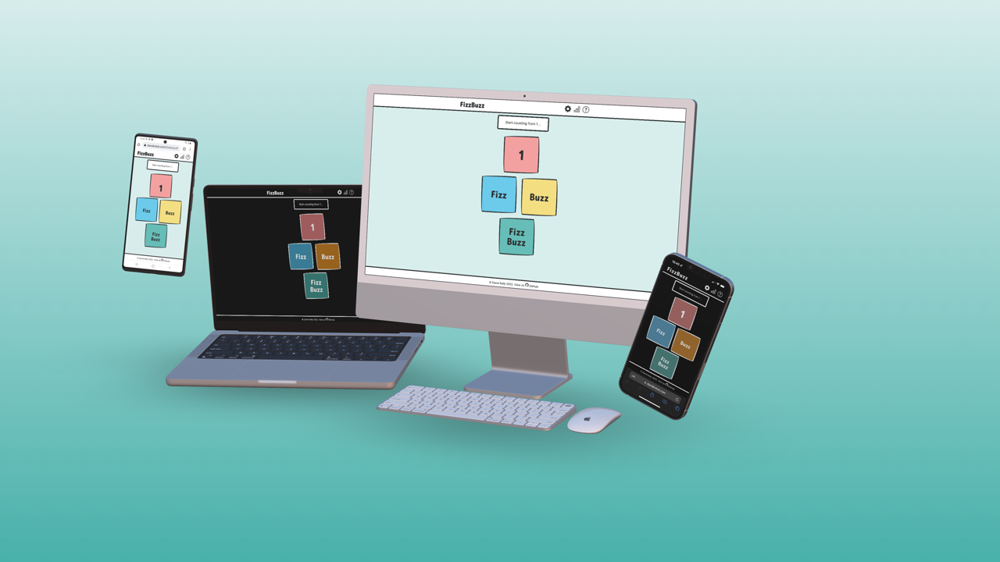
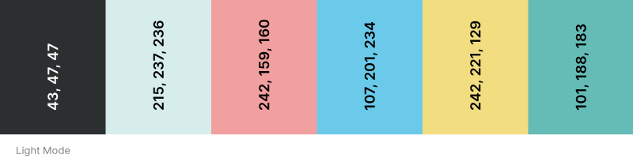
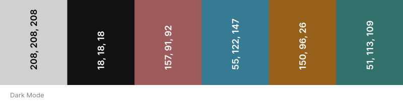
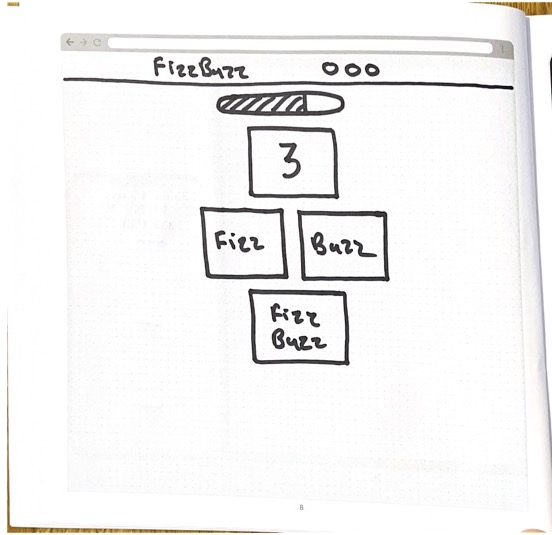
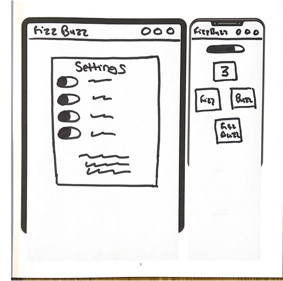
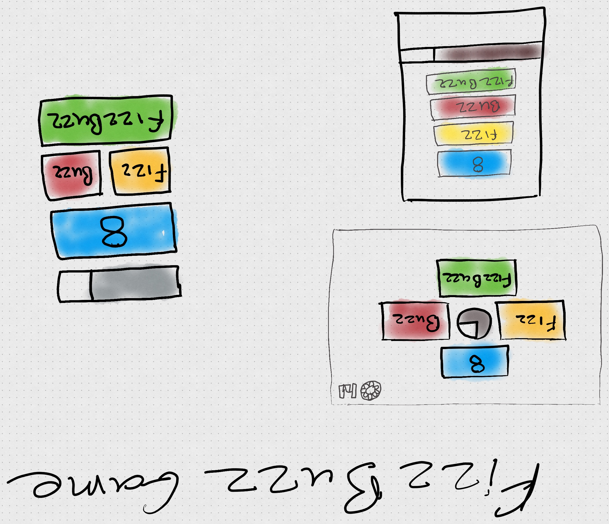
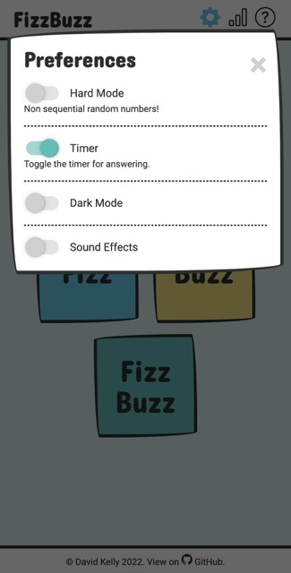
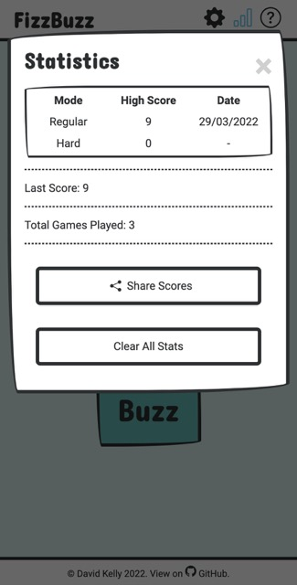
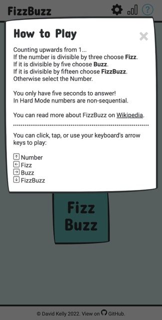

# FizzBuzz

[Link to Live Site](https://www.davidindub.com/fizzbuzz)

- [FizzBuzz](#fizzbuzz)
  * [Introduction](#introduction)
  * [Rules](#rules)
  * [User Stories](#user-stories)
  * [UX](#ux)
    + [Colour Scheme](#colour-scheme)
    + [Typography](#typography)
    + [Wireframes](#wireframes)
  * [Features](#features)
    + [Existing Features](#existing-features)
    + [Features Left to Implement](#features-left-to-implement)
  * [Technologies Used](#technologies-used)
  * [Testing](#testing)
  * [Deployment](#deployment)
    + [Local Deployment](#local-deployment)
  * [Credits](#credits)
    + [Content](#content)
    + [Media](#media)
    + [Acknowledgements](#acknowledgements)

## Introduction

- [Fizz Buzz](https://en.wikipedia.org/wiki/Fizz_buzz) is a word game about division.
- It is also a common challenge for beginner computer programmers to write a program that will output the correct sequence according to the rules.
- The project is a version of game that can be played in the browser.

## Rules

- The user counts upwards from 1.
- If the number is divisible by **3** they must select **"Fizz"**
- If the number is divisible by **5** they must select **"Buzz"**
- If the number is divisible by **15** they must select **"FizzBuzz"**
- You only have 5 Seconds to answer each time, so think quick!

Top Secret Combination for Testing!

1, 2, Fizz, 4, Buzz, Fizz, 7, 8, Fizz, Buzz, 11, Fizz, 13, 14, Fizz Buzz, 16, 17, Fizz, 19, Buzz, Fizz, 22, 23, Fizz, Buzz, 26, Fizz, 28, 29, Fizz Buzz, 31, 32, Fizz, 34, Buzz, Fizz… good luck!

## User Stories

- As a parent, I want a simple friendly game so my child can practice division.
- As a maths enthusiast, I want a more difficult game to challenge myself.
- I want to be able to share my high score with a friend
- I want to be able to play the game with my keyboard instead of clicking
- As I use dark mode user, I want the game to recognise my preference.

## UX  

 As I sketched out my wireframes, I liked the idea of the game having a hand drawn look with bold lines and soft colours. I was also reminded of the game [Snipperclips](https://www.nintendo.com/store/products/snipperclips-cut-it-out-together-switch/) and its friendly paper-like style.

### Colour Scheme

I based the colour scheme on the primary colours - Blue (Fizz) + Yellow (Buzz) = Green (FizzBuzz).

For Dark Mode the colours were adjusted to maintain readability with grey text.
 

### Typography

I used a friendly rounded font [Concert One](https://fonts.google.com/specimen/Concert+One) for the logo, headings and game buttons, and a sans-serif font [Roboto](https://fonts.google.com/specimen/Roboto) for the rest of the text. Both fonts were freely available from Google Fonts.

### Wireframes

I sketched my wireframes on an iPad using Concepts as I had recently completed the Udemy course [Sketching for UX Designers](https://www.udemy.com/share/101Zi03@dvXU0Ao_hYLw14VYm-w9uAFuMOpq-Xw2zw-m4U8GxK5v_ac9Qo-mX_OvZVINv60EgQ==/)

Wireframe Images

## Features 

### Existing Features

- __Navigation Bar__

  - Preferences 
  - Statistics
  - How to Play

The navigation bar includes three icons which pop up modals. The links are disabled while a game is in progress as you cannot change settings such as difficulty or the timer mid game.

I used inline SVGs for icons in the project both in the navigation bar and the How to Play modal.

I recently watched [Seren Davies](https://github.com/ninjanails)' talk [Death to Icon Fonts](https://www.youtube.com/watch?v=9xXBYcWgCHA) where I learned of the issues that icon fonts can cause for accessibility. I researched the best way to use inline SVG icons, including descriptions where appropriate for screen readers. By using SVGs the icons don't break if a user chooses to use a custom font such as [Dyslexie](https://www.dyslexiefont.com/).

See also:
- [Inline SVG vs Icon Fonts - CSS Tricks](https://css-tricks.com/icon-fonts-vs-svg/)
- [SVG, Icon Fonts, and Accessibility: A Case Study - 24 Accessibility](https://www.24a11y.com/2017/svg-icon-fonts-accessibility-case-study/)
***

__Game Area__

 - There are four buttons for the potential options in the game. These can be tapped or clicked, or the keyboard's arrow keys can be used in the same layout as the buttons to play. The buttons scale so the game is easy to play on all screen sizes.
 

***

__Modal__

- The game preferences, highscores and rules can all be found in modals overlayed ontop of the game, to keep a simple single page layout.

- The modals can be closed at any time by clicking outside the modal, clicking or tabbing to the × buttons, or pressing the Esc key.

- The HTML [`<dialog>` element](https://developer.mozilla.org/en-US/docs/Web/HTML/Element/dialog) doesn't have wide enough support yet to use (Safari only started supporting it in a new release while I was building this project), so I adapted a modal from [W3Schools](https://www.w3schools.com/howto/howto_css_modals.asp) to have three different modals and improved accessibility and used newer JS features than the example modal.

Screenshots of the Preferences, Statistics, and How to Play Modals

***

__Accessibility__

  - Keyboard controls are available so the game can be played without using a mouse on computers and modals can be closed with the Esc key.
  - `aria-live` is used to annouce the number on screen when playing the game, allowing be played using a screen reader, especially important when hard mode as numbers are non-sequential.
  - [WebAIM Contrast Checker](https://webaim.org/resources/contrastchecker/) was used to test the text and background colours.
  - There is audio and visual feedback for correct responses/game.
  - The game's timer can be turned off in system preferences for those who wish.
  - All SVG images are appropriately labelled for screen reader use.
  - The game was tested using the VoiceOver screen reader on macOS.

***

__Favicon__

  - A favicon and icon for iOS/Android home screen bookmarks is included with the project's logo.

  ***

__Sound Effects__

- Sound effects give audio feedback for correct answers and on game over.
- Sound effects can be toggled on and off in the preferences modal, and there is audio confirmation when turned on.
- The users preference will be stored for their next visit.

__Hard Mode__

- The user can choose a hard mode with non sequential (random) numbers under 1000.

__Timer__

- By default the user has 5 seconds for each response. The user can toggle on and off the timer to change the game's difficulty. The difficuly and timer preferences are rest to FizzBuzz standard rules on each visit.
- The timer uses the HTML5 `<progress>` element to display the remaining time to the user.

__Dark Mode__

- The first time the user visits the site, their OS system preference for Dark Mode is checked, and the game will display appropriately.
- The user can switch between Light and Dark Mode in the Preferences Modal, and their preference will be stored for their next visit so the game can load their preferred theme.

__Statistics__

- High Scores are saved for both regular and hard mode, as well as the date they were set on.
- The total number of games played is also recorded.
- I noted the popularity of users sharing their score on web games such as Wordle, so I implemented a similar simple way to share scores.
- The Share Scores button copies the user's highscores to their clipboard so they can share it with a friend in the app of their choice.
- The stats are stored in the users localstorage, and can be reset by clicking the Clear All Stats button.

__Meta Data__

  - Metadata was included in the `<head>` of each page to include a thumbnail of the site when shared on social media, and improve SEO.
  - Theme color metadata was included to theme the browser UI in Chrome (Android) and Safari (iOS and macOS) to match the selected theme.
  - `user-scalable=0` was included in the viewport metadata to prevent the page from zooming when buttons are tapped playing the game on mobile.

***

### Features Left to Implement

- Possible High Contrast Mode.
- Possible options for variations on the rules of play e.g. divide by 7.
- Perhaps use HTML dialog element for modal when browser compatibility is more widespread.

## Technologies Used

- [HTML](https://en.wikipedia.org/wiki/HTML) for the content of the pages, which are all static .html files. I used semantic elements where available to help assistive technologies and improve SEO.
- [CSS](https://en.wikipedia.org/wiki/CSS) for styling the pages and creating the responsive design.
- [JavaScript](https://en.wikipedia.org/wiki/JavaScript) for interactivity and client side game logic.
- [Window.localStorage](https://developer.mozilla.org/en-US/docs/Web/API/Window/localStorage) for storing users preferences and highscores between visits.

  - __CSS Variables__ were used to store the color pallete and fonts used, and then referenced in the styles. This improved readability and could be useful in future for changing colors, for example building a dark mode.

- [Git](https://git-scm.com/) for version control.
- [GitHub](https://github.com/) for storing the repository online during development.
- GitHub Projects was invaluable throughout the project and helped me keep track of things to do and bugs to fix - you can see [the project's board here](https://github.com/users/davidindub/projects/2).
- [GitPod](https://gitpod.io/) as a cloud based IDE.
- [Bootstrap Icons](https://icons.getbootstrap.com/) for icons used in the project.
- [Google Fonts](https://fonts.google.com/) for the two fonts used on the project.
- [favicon.io](https://favicon.io/favicon-generator/) to make a favicon for site.
- [Meta Tags](https://metatags.io/) to prepare the Meta tags for social media share previews.
- [Polypane](https://polypane.app/) for testing responsiveness on different viewports at the same time.
- [Google Chrome](https://www.google.com/intl/en_ie/chrome/), [Mozilla Firefox](https://www.mozilla.org/en-US/firefox/new/) and [Safari](https://www.apple.com/safari/) for testing on macOS Monterey, Windows 10, iOS 15, iPadOS 15 and Android 10.
- [Concepts](https://concepts.app/en/) for sketching on an iPad.

## Testing 

Please visit [TESTING.md](TESTING.md) for detailed testing and bugs discovered.

## Deployment

The site was deployed to GitHub pages. The steps to deploy are as follows: 
  - In the [GitHub repository](https://github.com/davidindub/fizzbuzz), navigate to the Settings tab 
  - From the source section drop-down menu, select the **Main** Branch, then click "Save".
  - The page will be automatically refreshed with a detailed ribbon display to indicate the successful deployment.

The live link can be found [here](https://www.davidindub.com/fizzbuzz)

### Local Deployment
The steps to deploy are as follows: 
  - In the GitHub repository, navigate to the Settings tab 
  - From the source section drop-down menu, select Main Branch
  - Once the main branch has been selected, the page will be automatically refreshed with a detailed ribbon display to indicate the successful deployment. 

In order to make a local copy of this project, you can clone it. In your IDE Terminal, type the following command to clone my repository:

- `git clone https://github.com/davidindub/fizzbuzz.git`

Alternatively, if using Gitpod, you can click below to create your own workspace using this repository.

## Credits 

### Content 

- [Wikipedia](https://en.wikipedia.org/wiki/Fizz_buzz) for the entry on the rules of Fizz Buzz.
- I used the [MDN Web Docs](https://developer.mozilla.org/en-US/) for help with data attributes in HTML.
- I read [W3 Schools](https://www.w3schools.com/howto/howto_css_modals.asp/) for information on how to make tool tips and modals, and adapted code from their examples.
- I used a blog post, [Accessibility first: toggle switches](https://dev.to/link2twenty/accessibility-first-toggle-switches-3obj) for help making accessible toggle buttons for the preferences modal.
- The shaking animation on a game over comes from [Unused CSS](https://unused-css.com/blog/css-shake-animation/).
- The Stack Overflow post '[Hiding content accessibly now that clip is deprecated?](https://stackoverflow.com/questions/34715367/hiding-content-accessibly-now-that-clip-is-deprecated)' for help visually hiding elements.
- For the game's timer I reworked some code I wrote for the project [Calma](https://github.com/GJSayers/calma) from a recent Hackathon I participated in.

### Media

- Sound Effects are from [mixkit.co](https://mixkit.co/free-sound-effects/)
- Device Mockup created from [Device Frames](https://deviceframes.com/).

### Acknowledgements

- Thank you to my CI Mentor [Tim Nelson](https://github.com/TravelTimN) for his help and suggestions.
- Thanks to my partner David for his constant support on my journey to a new career.