## Testing

### Browser Compatibility

I tested the website on four different operating systems on four different types of hardware.

| Operating System | Chrome | Firefox | Edge | Safari |
|------------------|--------|---------|------|--------|
| macOS 12.2       | ✅      | ✅       | ✅    | ✅      |
| Windows 10       | ✅      | ✅       | ✅    | ✅    |
| Android 10       | ✅      | ✅       | ✅    | ✅      |
| iOS & iPadOS 15  | ✅❗️     | ✅ ❗️      | ✅❗️    | ✅❗️      |

❗️ Bug with Sounds - detailed below.
🔸 All iOS browsers use WebKit for rendering so perform same as Safari

#### Testing Favicon on all Browsers

Favicon testing

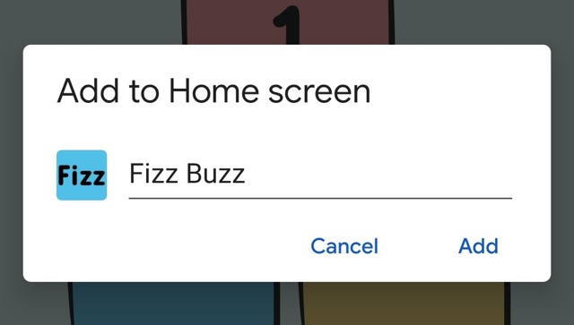

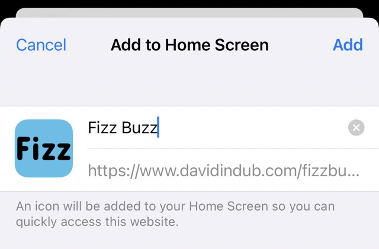

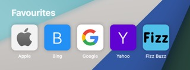

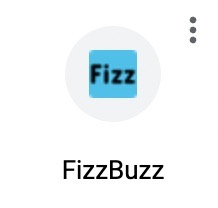

### Accessibility

- No errors were detected using the [WAVE Web Accessibility Evaluation Tool](https://wave.webaim.org/report#/https://www.davidindub.com/fizzbuzz/).
- Two alerts were displayed due to the `audio` elements not having visible controls - however the game's audio can easily be turned on and off in the Preferences modal and is off by default.

  

  
WAVE Web Accessibility Evaluation Tool Results

  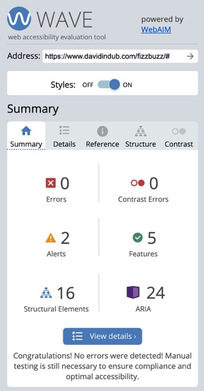

  </detais>

### Code Validation

- HTML

  - No errors were returned when passing through the official [W3C validator](https://validator.w3.org/nu/?doc=https%3A%2F%2Fwww.davidindub.com%2Fplant-cafe%2F).
  - There was one warning about the metatag which prevents the page from zooming in when the buttons are tapped on mobile. Zoom is still available by pinching. There is two warning about the sections elements lacking headers which aren't applicable to the game area.

  

  
HTML Validator Results

  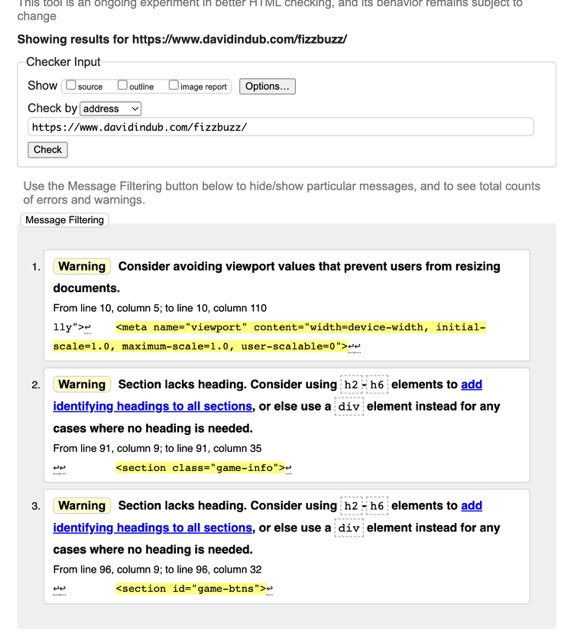

  

***

- CSS

  - No errors were found when passing through the official [W3C CSS Validation Service](https://jigsaw.w3.org/css-validator/validator?uri=https%3A%2F%2Fwww.davidindub.com%2Fplant-cafe%2F&profile=css3svg&usermedium=all&warning=1&vextwarning=&lang=en).

    

  

  
CSS Validator Results

    

  

***

- JavaScript

- No errors where found when passing through the [JSHint](https://jshint.com/) validator.

  

  
JSHint Validator Results

  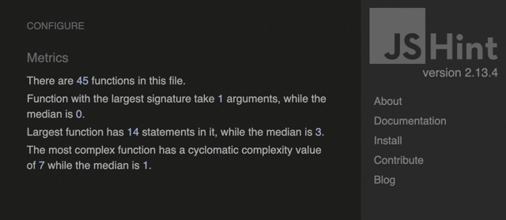

  

***

### Responsiveness

I tested for responsiveness on many different sized viewports from 320px wide up to Ultrawide resolutions, and using different hardware (Monitors, Laptops, Phones).

I used Polypane to test many different viewport sizes at once.

Polypane Screenshot

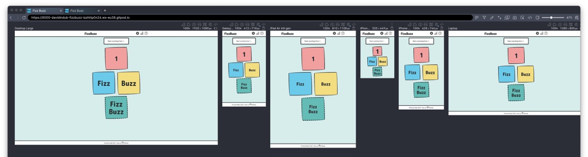

  
***
    
### Performance

The project was tested for performance on Mobile and Desktop using [Google Lighthouse](https://developers.google.com/web/tools/lighthouse).

Lighthouse Test Results

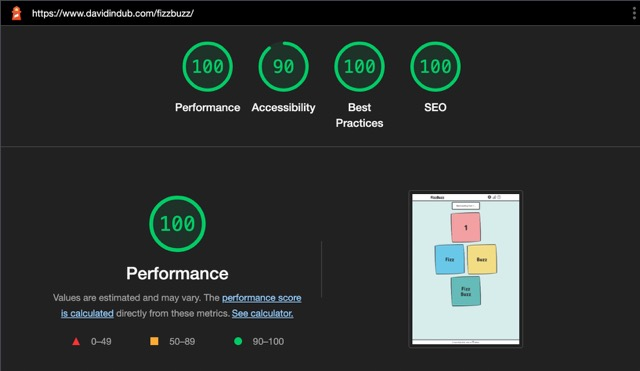

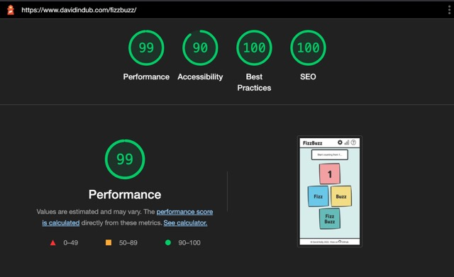

#### Lighthouse Scores

| **Device** | **Performance** | **Accessibility** | **Best Practices** | **SEO** |
|----------|-----------------|-------------------|--------------------|---------|
| Mobile  | 99              | 90               | 100                | 100      |
| Desktop  | 100              | 90               | 100                | 100     |

***

### User Story Tests

> As a parent, I want a simple friendly game so my child can practice division.

  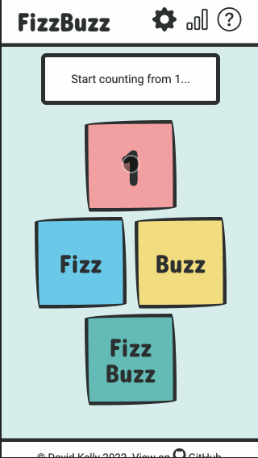

  1. On visiting the page, we read the rules of the game and there is also a link to Wikipedia to learn more.
  2. We close the modal and begin to play.
  3. After a game over, I click the preferences pane and see that I can change the setting to turn off the timer for an easier game.

  **Result:** Pass ✅

> As a maths enthusiast, I want a more difficult game to challenge myself.

  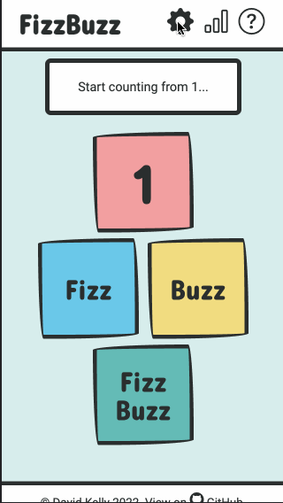

  1. On visiting the site first I see the Hard Mode mentioned in the rules.
  2. I click the cog icon for preferences and turn on Hard Mode.
  3. Now I can play a more challenging game with random numbers.

  **Result:** Pass ✅

> I want to be able to share my high score with a friend

  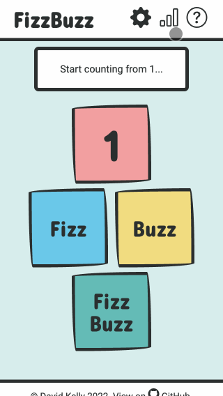

  1. At the end of a game, or by clicking the Statistics modal, there is a button with the option to Share Scores.
  2. When I click this I see the message "Copied to Clipboard!"
  3. I can then paste the text into a message to send to my friend.

  **Result:** Pass ✅

> I want to be able to play the game with my keyboard instead of clicking

  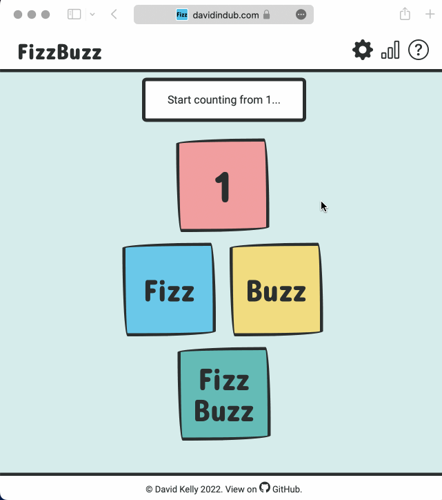

  1. On visiting the site on my computer I see in the modal that appears that keyboard controls are available.
  2. I press Esc to close the modal, and begin to play the game.
  3. The keys are mapped to the same layout as the buttons on screen, and there is visual feedback when I press them.
  4. I can now play the game without using a mouse.

  **Result:** Pass ✅

> As I use dark mode user, I want the game to recognise my preference.

  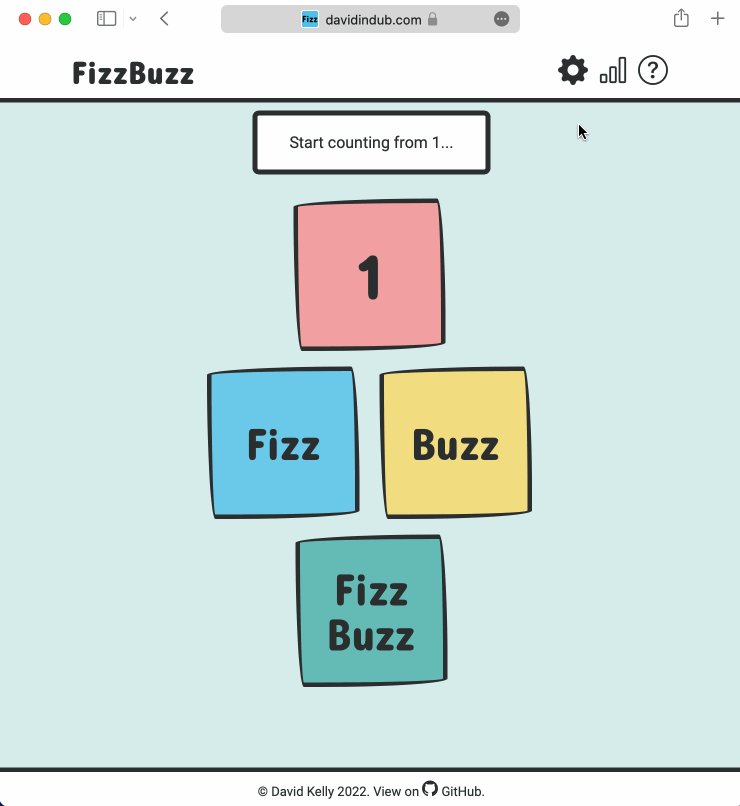

  1. I have Dark Mode enabled on my computer, and on visiting the site for the first time it recognises this and loads in a Dark Theme.
  2. Later I decide to try the Light theme in the preferences pane.
  3. The next time I visit the game it loads my last used preference (Light).

  **Result:** Pass ✅

***

### Bugs

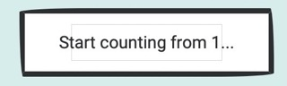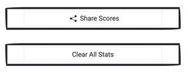

When using Safari, certain `border-radius` styles causes a grey box to appear inside some elements, and thereford I couldn't use the wavey border style on certain elements. Unpredictable clipping and issues with border-radius seem to be a [known issue](https://www.google.com/search?q=safari+border-radius+short-hand) with Safari/WebKit.

### Unfixed Bugs

❗️ Safari on mobile sometimes clips the sound effects when the buttons are tapped in quick succession.